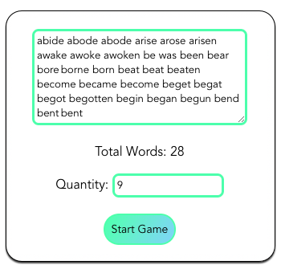

# LibP2P - Second Language Educational Playground

Teachers create rooms for students join and play. Teachers could define parameters of matches and play with students monitoring scores in realtime.

[Live Demo!](https://filipesoccol.github.io/libp2p-second-language-playground/)



This project was bootstrapped with [Vue CLI](https://cli.vuejs.org/).

## Before you start

First clone this repo, install dependencies in the project root and build the project.

```console
$ git clone https://github.com/filipesoccol/libp2p-second-language-playground
$ cd libp2p-second-language-playground
$ npm install
$ npm run build
```

### Compiles and hot-reloads for development

```console
$ npm run serve
```

### Compiles and minifies for production

```console
$ npm run build
```

### Run your deploy to github pages

```console
$ npm run deploy
```

### Run your tests

```console
$ npm run test
```

### Lints and fixes files

```console
$ npm run lint
```

### Signaling Servers are important

Verify signaling servers in case two peers not seen each other.
[Check here](https://github.com/filipesoccol/libp2p-pubsub-vue/blob/c4f92ebefdb6750f5ec0ab883c8a738d76b23f9a/src/plugins/vue-libp2p.js#L17)

### Customize configuration

See [Configuration Reference](https://cli.vuejs.org/config/).


### Message Protocol
```

// HOST - Ping
{type: 'ping', message: 8}

// HOST - Word Options Message
{type: 'words', message: ['word1', 'word2', 'word3']}

// HOST - Word Quantity
{type: 'quantity', message: 8}

// HOST - Lock Words / Draft started
{type: 'lock', message: ''}

// GUEST - Join Message
{type: 'join', message: 'username'}

// GUEST - Chosen words
{type: 'chosen', message: ['word1', 'word2', 'word3']}

// GUEST - Scored word
{type: 'scored', message: 'word1'}

// GUEST - UnScored word
{type: 'unscored', message: index}


```